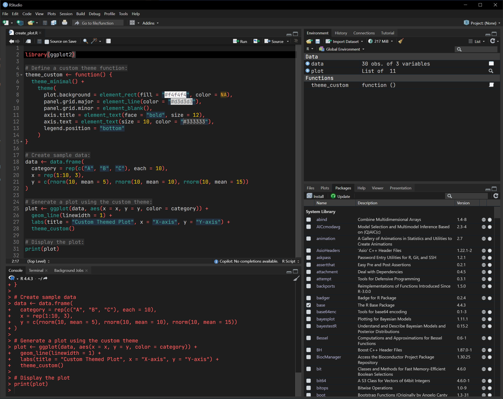

# darkforest

A custom RStudio theme.



# Installation:

To install `darkforest`, run the following commands in `R`:

``` r
install.packages("remotes")
remotes::install_github("ecoisilva/darkforest")
```

2.  Then run:

``` r
darkforest::install_theme()
```
